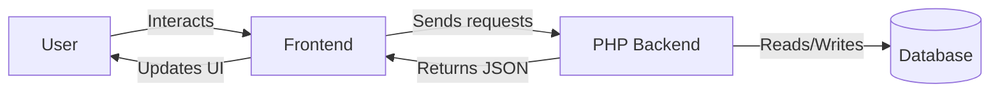
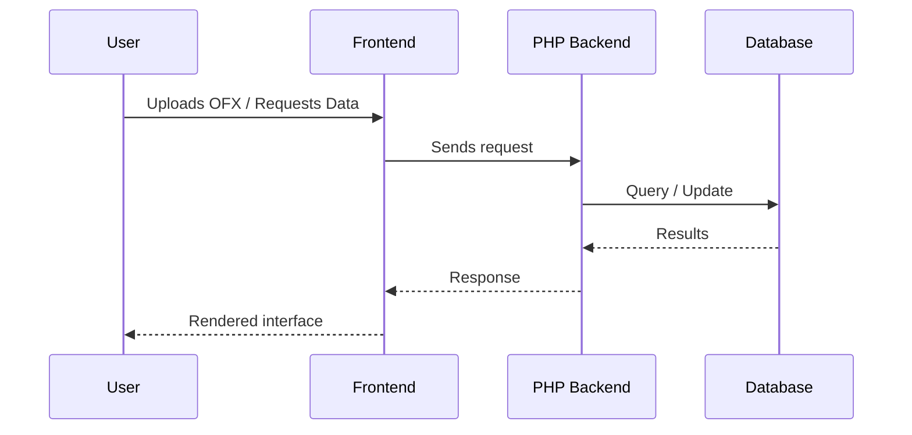

# Accounts

This repository now provides a simple PHP implementation for managing accounts and transactions.

## How It Works

### Architecture


### Request Flow


## Capabilities

- Upload OFX files to import bank statements.
- Explore yearly and monthly dashboards to analyse spending.
- Visualise trends with interactive graphs.
- Automatically tag transactions and propose budgets using AI.
- Analyse recurring expenses and break down spending by segments and categories.
- Secure access with two-factor authentication.
- Search and report on transactions in detail.
- Generate reports using natural-language queries.
- Back up and restore your data and export it to OFX, CSV, or XLSX.
- Manage user accounts, processes, and logs.

- Share links to the site with rich previews via Open Graph metadata.
 
## Natural-language Reports

The reporting page now accepts plain English queries. Enter phrases such as "costs for cars in the last 12 months" in the Ask in plain English field on `frontend/report.html`. When an OpenAI API token is configured the backend sends the query to the AI service which returns category, tag, segment and date filters that populate the normal selectors before running the report. Without a token a simple rule-based parser is used. Leaving the field empty falls back to manual selection.

## Quick Deployment

```bash
curl -fsSL https://raw.githubusercontent.com/smeird/Accounts/main/deploy.sh | bash
```

The script clones the repository, sets up the database, and creates an initial user.

## Authentication

A basic login page is available at the project root (`index.php`). Users are stored in a `users` table. After logging in, visit `users.php` to add new users or change your password.

### Two-Factor Authentication (TOTP)


Two PHP endpoints under `php_backend/public` handle TOTP setup and verification and a third removes secrets. `totp_generate.php` issues a per-user secret and returns an otpauth URI, `totp_verify.php` validates submitted codes, and `totp_disable.php` deletes an existing secret. The QR code is rendered client-side using the `qrcodejs` library. The login page prompts for a code when a secret exists, and you can manage or disable 2FA from `users.php` or open `frontend/2fa.html` to scan the QR code with your authenticator and confirm the one-time codes it generates.


## Specifications

- Highcharts is used for graphs, while Tabulator renders interactive tables.
- Display all monetary values using the pound symbol (£) instead of the dollar sign ($).
- Tailwind CSS provides the styling and Font Awesome supplies icons. Sections are wrapped in card components.
- Headings use bold Roboto, body text uses Inter, and buttons or highlights use light Source Sans Pro.

- Tabulator tables apply Tailwind utility classes for a consistent look and use the Simple theme.

- Form inputs may include a `data-help` attribute to show popover guidance.
- Transactions identified as transfers are flagged and ignored in totals.

- The budgets page offers AI budgeting that sends a year of category totals and your savings goal to the OpenAI API to propose next month's limits and returns a short explanation of the allocations.

- The interface is responsive. Each page includes a viewport meta tag and uses Tailwind's responsive utilities so the site works
  on mobile devices. The navigation menu collapses to a toggle button on small screens.

## PHP Development Setup

1. Ensure PHP and MySQL are installed.
2. Configure database credentials using the environment variables `DB_HOST`, `DB_NAME`, `DB_USER` and `DB_PASS`.
3. Create the database tables:
   ```bash
   php php_backend/create_tables.php
   ```
   Re-running this script after upgrading will also add any new columns.
4. Run the example script which inserts a sample account:
   ```bash
   php php_backend/public/index.php
   ```

Any errors during upload or other operations are stored in a `logs` table.

You can view these entries by opening `frontend/logs.html` which calls the
`php_backend/public/logs.php` endpoint.


To import transactions from one or more OFX files, use the upload script:
```bash
curl -F "ofx_files[]=@first.ofx" -F "ofx_files[]=@second.ofx" https://localhost/path/to/php_backend/public/upload_ofx.php
```
You can try this using the included sample file `sample_data/test.ofx` which
contains two transactions for a checking account.

Account names you've customised in the UI are preserved. Uploading new OFX files will not overwrite renamed accounts.


The importer normalises line endings, strips control characters and converts
character encoding to UTF-8, falling back to iconv when the mbstring extension
is unavailable.

To guard against duplicate imports, each transaction receives a synthetic
identifier derived from the account ID, date, amount and a normalised
description. When present, reference numbers (`<REFNUM>`), cheque numbers
(`<CHECKNUM>`) and a hash of the raw `<STMTTRN>` block are appended to the
hash input. This composite value greatly reduces the chance of collisions when
banks reuse identifiers or vary memo text.

Institution-specific JSON profiles in `php_backend/profiles/` supply default
behaviour and field caps. Profiles are selected using the `<FI>` `ORG` or
`FID` value and can normalise `CHECKNUM`, `REFNUM` and `MEMO` fields or enforce
length limits. A `default.json` profile is used when no matching file exists.


## Running a Local Server

To use the upload page the frontend must be served over HTTPS so the PHP parser
can receive the request. From the repository root run:

```bash
php -S localhost:8000
```

Then open `https://localhost:8000/frontend/index.html` in your browser.


## Apache Setup

For a persistent deployment use Apache and provide the database credentials as
environment variables. A simple virtual host might look like:

```apache
<VirtualHost *:80>
    DocumentRoot /var/www/Accounts
    <Directory /var/www/Accounts>
        Require all granted
        AllowOverride All
    </Directory>

    SetEnv DB_HOST localhost
    SetEnv DB_NAME accounts
    SetEnv DB_USER accounts_user
    SetEnv DB_PASS change_me
</VirtualHost>
```

Reload Apache after editing the configuration (`sudo systemctl reload apache2`).
The `SetEnv` directives expose the credentials to PHP through `getenv()` and
`$_ENV`, keeping secrets out of the codebase. You can also place the variables
in an external file and load it with the `EnvFile` directive so the values
remain outside the project directory.


## Backup and Recovery

Back up and restore your data through the web interface. From the navigation

menu open **Backup & Restore** under *Administration*. User accounts and
account information are always included in backups. You can additionally choose
which other parts of the database to download—transactions, categories, tags,
groups, segments, projects, or budgets. The downloaded file contains gzipped JSON and is named after
your site's hostname, the current date, and the selected sections (for example,
`example.com-2024-05-15-transactions-categories.json.gz`). To restore a backup,
choose the compressed file on the same page and click **Restore**; any included
sections are imported.

To download transactions for use in other tools, open the **Exports** page.
Choose a date range and an output format such as OFX, CSV or XLSX to
generate a file.


## Frontend


A Tailwind-styled frontend can be opened directly from `frontend/index.html`. It provides a navigation menu with Font Awesome icons to upload OFX files, view statements, run reports, or explore graphs.

The yearly dashboard page (`frontend/yearly_dashboard.html`) lets you select a year and view total spending by tag, category, and group with tables and bar charts.

The monthly dashboard page (`frontend/monthly_dashboard.html`) shows totals by tag, category, and group for a selected month along with overall income, outgoings, and delta.

The graphs page (`frontend/graphs.html`) displays additional Highcharts visualisations and includes a year selector.

The monthly statement page (`frontend/monthly_statement.html`) allows selecting a month and year to list transactions for that period.

Many form inputs include popover help that appears when fields with a `data-help` attribute are focused or hovered.

## Reports

The frontend also includes a simple reporting page available at `frontend/report.html`.
It allows running a report to list all transactions filtered by category, tag or group.
Reports can be saved in the browser for reuse and removed when no longer needed.
The page sends requests to `php_backend/public/report.php` which returns matching
transactions as JSON.

## Running Tests

The repository includes a small test script that exercises the user model using
an in-memory SQLite database. It does not require a MySQL server, making it
suitable for environments where a database is unavailable.

Run the tests with:

```bash
php tests/run_tests.php
```


## Automated Deployment


This project uses GitHub Actions to trigger deployments. On pushes to the `master` branch, the workflow sends a request to your deployment server:


```
curl https://your.web.server.com/automated_deployment.php
```


Create `.github/workflows/deploy.yml` with:

```yaml
name: Deploy
on:
  push:
    branches: [ master ]
jobs:
  deploy:
    runs-on: ubuntu-latest
    steps:
      - name: Trigger automated deployment
        run: curl https://your.web.server.com/automated_deployment.php
```


On the server, `automated_deployment.php` should pull the latest code:

```
<?php
shell_exec('cd /var/www/myproject && git pull');
```

