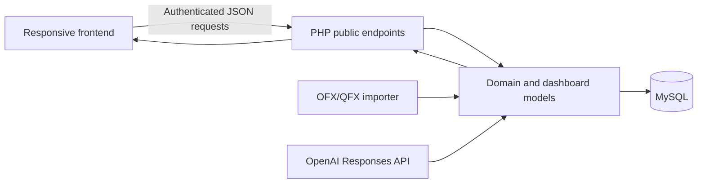

# Accounts

Accounts is a self-hosted personal finance workspace built with PHP, MySQL and a responsive HTML/JavaScript frontend. It imports bank activity from OFX/QFX statements, organises transactions through reusable tags and classifications, and turns the ledger into practical dashboards for balances, spending, budgets, forecasts and longer-term decisions.

The interface is organised around six tasks: **Overview**, **Transactions**, **Insights**, **Planning**, **Organise** and **System**. See the [project wiki](wiki/Home.md) for development documentation and the [visual style guide](wiki/StyleGuide.md) for UI conventions.

## Product map

### Overview

- **Financial Overview** — the quickest cross-feature view of balances, cash flow, budgets, recent activity and items needing attention.
- **Accounts & Balances** — active account balances, balance dates, recent movement and closed-account management.
- **Monthly Activity** — a statement-style transaction view with clear segment, category, tag and group classifications.

### Transactions

- Atomic multi-file OFX/QFX import with per-file progress and useful completion summaries.
- Duplicate protection based on bank FITIDs and a storage-safe fallback transaction identity.
- OFX ledger-balance handling with statement-date ordering and protection against unreliable zero placeholders.
- Transaction search, saved reports, portable exports, a polished multi-sheet Excel financial workbook, and printable/PDF reporting.
- Assisted transfer matching. Confirmed transfers remain in the ledger but are excluded from income, expenditure, budgets, projects and forecasts.

### Insights

- **Trends & Comparisons** — one period explorer for monthly, yearly, all-time and custom comparisons across categories, segments, groups and tags.
- **Daily Burn** — observed expenditure converted into a daily rate and broken down by segment. Each month is divided by its actual calendar days, while a separate chart preserves real transaction-day spikes.
- **12-Month Forecast** — expected, conservative and optimistic balance paths based on observed transaction history.
- **Year in Review**, **Financial Picture**, **Regular Income & Bills**, **Analysis Matrix** and **AI Financial Review**.

### Planning and organisation

- Monthly category budgets with visual runway/progress bars and optional AI suggestions.
- Project portfolio, comparison board and archive, with fixed-weight priority tiers based on consequence of delay, urgency, asset preservation, financial impact and daily-life impact. Project spending remains linked to transaction groups.
- Reusable tags and aliases so one learned merchant rule can classify similar future transactions without creating a tag per transaction.
- One-screen category and segment assignment workspaces with search and immediate one-click updates.
- AI-assisted mapping of unassigned tags to existing categories while preserving established mappings.
- **Tagging workspace** combines the unmatched-transaction inbox, canonical catalogue, deterministic rules, constrained AI assistance and completed rebuild history. Canonical tags can be merged or retired without silently clearing historical classifications, rule usage is measured, and overlapping rule wording requires explicit confirmation.
- **Taxonomy rebuild history** preserves the immutable snapshot, reviewed pattern and cutover audit from the completed catalogue rebuild. The one-off phase tools remain available by direct administrative URL for recovery but are intentionally absent from everyday navigation.
- **AI Data Fix** turns a plain-English tagging problem into a reviewable correction plan, updates only confirmed transaction tags, moves relevant alias rules and retains an emptied source tag as merged audit history.

### Administration

- Passkey-first sign-in with conditional browser discovery, plus passwords and TOTP as fallbacks. Passkeys support Face ID, Touch ID, device PINs and compatible security keys without sending a private key to the server.
- Backup and restore for accounts, public passkey credentials, transactions, classifications, taxonomy staging, projects, budgets and settings.
- Database Health compares the installation with the canonical schema and offers review-first, schema-only repairs.
- The three-phase taxonomy rebuild creates an immutable classification snapshot, stages and reviews a compact AI-assisted vocabulary, then applies it through an atomic, financially reconciled cutover with an audited rollback path.
- Automation Centre, logs, duplicate checks and configurable branding, expanded accent palettes, grouped typography choices, surfaces, spacing, corners, backdrop strength, header scale, animated accent-bar thickness and motion.
- Distinct Glass and Paper workspaces: Glass keeps the expressive layered interface, while Paper presents a flatter, denser document canvas with ruled sections and ledger-style tables.
- Dashboard heroes use a compact financial-brief layout, keeping headline context and supporting metrics while using horizontal space before page height.
- Explicit no-store/revalidation rules prevent stale HTML, CSS and JavaScript after deployments.

## Financial rules

- Positive amounts are income; negative amounts are expenditure.
- Confirmed account transfers are excluded from financial totals.
- Transactions using the `IGNORE` tag are excluded from analytical totals.
- Closed accounts retain history but contribute a zero live balance and ignore imported balance updates until reopened.
- Segment reporting prefers the transaction’s segment and falls back to the segment linked through its category.
- Daily Burn divides each calendar month’s observed expenditure by that month’s number of days. It expresses a monthly mortgage as a comparable daily cost without pretending it was transacted every day.

## Architecture


```mermaid
flowchart LR
    Browser[Responsive frontend] -->|Authenticated JSON requests| API[PHP public endpoints]
    API --> Models[Domain and dashboard models]
    Models --> DB[(MySQL)]
    Import[OFX/QFX importer] --> Models
    AI[OpenAI Responses API] --> Models
    Models --> API
    API --> Browser
```

Frontend pages live in `frontend/`. Authenticated JSON endpoints live in `php_backend/public/`, reusable domain logic in `php_backend/models/`, and import/health workflows in `php_backend/services/`. `php_backend/SchemaCatalog.php` is the canonical schema description used by Database Health. See [Architecture](wiki/Architecture.md) for more detail.

## Technology

- PHP 7.0+, PDO and MySQL
- SQLite in-memory for automated tests
- HTML, CSS and vanilla JavaScript
- Highcharts for interactive charts
- Self-hosted Tabulator 6.5.0 for large or interactive grids
- Native semantic responsive tables for statement and account views
- Tailwind utilities, shared application CSS and Font Awesome
- OpenAI Responses API for optional AI workflows

## Installation

### Simple Raspberry Pi installation

Use a fresh Raspberry Pi running **64-bit Raspberry Pi OS Bookworm or Trixie**. The installer creates a new Accounts installation; it does not overwrite an existing one.

#### 1. Prepare the Pi and your network

Before running the installer:

1. Give the Pi a stable local IP address and make sure SSH works.
2. Create a public DNS name, such as `accounts.example.com`, pointing to your internet connection.
3. Forward TCP ports **80** and **443** from the router to the Pi.
4. Confirm that at least 2 GB is free under `/var`:

   ```bash
   df -h /var
   ```

5. Do not create `/var/www/accounts` or an `accounts` database—the installer creates both.

#### 2. Run the installer

Connect to the Pi using SSH, then run:

```bash
curl -fsSL https://raw.githubusercontent.com/smeird/Accounts/main/deploy.sh | sudo bash
```

The installer asks for:

- the public DNS name;
- an email address for the HTTPS certificate;
- the first administrator username;
- a password of at least 12 characters;
- confirmation that DNS and port forwarding are ready.

It then installs and configures Apache, MariaDB, PHP, HTTPS and certificate renewal, the firewall, fail2ban, and automatic security updates. This can take several minutes, particularly while Raspberry Pi OS packages are updated.

#### 3. Sign in and check the installation

When installation finishes, it prints the secure address and installed code version. Open the displayed `https://` address and sign in with the administrator details you entered.

After signing in:

1. Open **System → Database Health** and confirm the database is current.
2. Open **System → Backup & Restore**, create a backup, and store it away from the Pi.
3. If moving from an older Accounts installation, restore its backup through **System → Backup & Restore**.

If installation stops, correct the reported problem and run the same command again. Detailed output is stored in `/var/log/accounts-installer.log`. DNS and router configuration remain external prerequisites, and the Pi needs outbound internet access for installation, update checks, hosted interface libraries, and optional OpenAI features. The installer will not expose the application over ordinary HTTP if HTTPS certificate validation fails.

For troubleshooting and a detailed description of the safety checks, see [Setup](wiki/Setup.md#raspberry-pi-production-installation).

### Manual setup

1. Install PHP, PDO MySQL and MySQL. Production installs also require PHP cURL, mbstring, ZIP, XML, OpenSSL, JSON and session support.
2. Provide `DB_HOST`, `DB_NAME`, `DB_USER` and `DB_PASS` to PHP. Apache deployments can use `SetEnv` in the virtual host.
3. Create or update the schema:

   ```bash
   php php_backend/create_tables.php
   ```

4. Installations predating the transaction-identity update must run once:

   ```bash
   php php_backend/migrations/20260814_transaction_identity.php
   ```

   Existing installations adding passkeys must also run **System → Database Health** or:

   ```bash
   php php_backend/migrations/20260831_passkeys.php
   ```

5. Serve the repository and sign in through `index.php`:

   ```bash
   php -S localhost:8000
   ```

   Open `http://localhost:8000/`.

After upgrades, open **System → Database Health**. It identifies missing tables, columns, indexes and relationships without modifying transaction records. See [Setup](wiki/Setup.md) for Apache and environment details.

Existing private-repository deployments can enable **System → Application Updates** without exposing a deployment SSH key to Apache. Install the root-owned, allowlisted helper once, naming the checkout and the Linux user that already has read access to GitHub:

```bash
sudo bash scripts/install-application-update-helper.sh /var/www/newaccounts ubuntu
```

The helper grants `www-data` only the fixed Git status, fetch and clean fast-forward operations used by the application. It refuses arbitrary commands, other repositories, other remotes, branch changes, dirty worktrees and non-fast-forward updates. Re-run the installer after a release changes either helper script, because the installed root-owned copy is deliberately not self-modifying.

The original AI-assisted taxonomy rebuild used **Tag Rebuild Safety**, **Taxonomy Studio** and **Taxonomy Cutover** to create an immutable baseline, stage and review a compact vocabulary, apply classifications atomically, and retire the legacy catalogue without changing financial data. That rebuild is now complete. Its pages and stored evidence remain available for recovery and audit, while normal work happens in **Organise → Tagging → Rebuild history**. See [Tag Taxonomy Rebuild](wiki/TagTaxonomyRebuild.md).

## OFX/QFX import

Use **Transactions → Import Transactions**, or call the endpoint directly:

```bash
curl -F "ofx_files[]=@first.ofx" -F "ofx_files[]=@second.ofx" \
  https://example.test/php_backend/public/upload_ofx.php
```

The importer normalises encoding, preserves full memos, resolves masked account identifiers where possible, processes every file atomically and reports inserted, duplicate, tagged, categorised and balance-refresh outcomes separately. Institution profiles in `php_backend/profiles/` control bank-specific field normalisation.

## AI configuration

Configure the API token, model, temperature and debug mode under **System → Settings**. Tokens remain server-side and are never returned to the browser. AI features use the OpenAI Responses API with structured JSON output and degrade to manual or deterministic workflows when no token is configured.

## Frontend conventions

New pages must follow the shared system rather than introducing a standalone visual language:

- Render the modern page header with `frontend/js/page_header.js`.
- Use shared glass/solid card surfaces and the readable type scale.
- Honour configured heading, body, table and chart fonts; use the curated grouped catalogue and load only selected web fonts.
- Use native tables for straightforward read-only views and the shared Tabulator adapter for large interactive datasets.
- Use consistent classification colours and a visible key rather than repeating type names inside every pill.
- Provide useful loading, empty and error states, contextual help and accessible labels.
- Verify desktop and mobile layouts and avoid document-level horizontal overflow.

The complete rules and examples are in the [Style Guide](wiki/StyleGuide.md).

## Testing

The primary suite uses an in-memory SQLite database and requires no production-data access:

```bash
php tests/run_tests.php
```

Run frontend regressions with:

```bash
for test_file in frontend/js/*.test.js; do node "$test_file"; done
```

Validate the Raspberry Pi installer with:

```bash
bash tests/deploy_installer_test.sh
shellcheck deploy.sh
```

Before merging UI work, also run PHP lint, JavaScript syntax checks, `git diff --check`, and browser verification at desktop and mobile widths.

## Backups and deployment safety

Use **System → Backup & Restore** for gzipped JSON backups and **System → Export Data** for OFX, CSV and JSON extracts or a complete Excel financial workbook. The Excel export includes a period summary, pivot-style analysis and a filterable transaction ledger; internal transfers and ignored rows remain visible but are excluded from analytical totals. Full backups include passkey public credentials, tag-rebuild runs and their immutable classification snapshots. Treat these files as sensitive financial data.

Keep credentials and API tokens outside the repository, serve production over HTTPS (required by browsers for passkeys outside localhost), allow the included `.htaccess` cache policy, and deploy from `main`. `PASSKEY_ORIGIN` and `PASSKEY_RP_ID` may be set when a reverse proxy means PHP cannot infer the public HTTPS origin and hostname. Do not use `--allow-unrelated-histories` on a production checkout; preserve configuration/uploads and use a clean clone if the server directory does not share this repository’s history.
