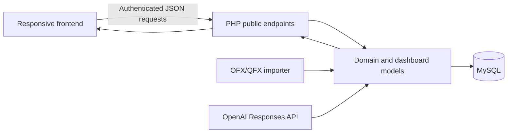

# Accounts

Accounts is a self-hosted personal finance workspace built with PHP, MySQL and a responsive HTML/JavaScript frontend. It imports bank activity from OFX/QFX statements, organises transactions through reusable tags and classifications, and turns the ledger into practical dashboards for balances, spending, budgets, forecasts and longer-term decisions.

The interface is organised around six tasks: **Overview**, **Transactions**, **Insights**, **Planning**, **Organise** and **System**. See the [project wiki](wiki/Home.md) for development documentation and the [visual style guide](wiki/StyleGuide.md) for UI conventions.

## Product map

### Overview

- **Financial Overview** — the quickest cross-feature view of balances, cash flow, budgets, recent activity and items needing attention.
- **Accounts & Balances** — active account balances, balance dates, recent movement and closed-account management.
- **Monthly Activity** — a statement-style transaction view with clear segment, category, tag and group classifications.

### Transactions

- Atomic multi-file OFX/QFX import with per-file progress and useful completion summaries.
- Duplicate protection based on bank FITIDs and a storage-safe fallback transaction identity.
- OFX ledger-balance handling with statement-date ordering and protection against unreliable zero placeholders.
- Transaction search, saved reports, exports and printable/PDF reporting.
- Assisted transfer matching. Confirmed transfers remain in the ledger but are excluded from income, expenditure, budgets, projects and forecasts.

### Insights

- **Trends & Comparisons** — one period explorer for monthly, yearly, all-time and custom comparisons across categories, segments, groups and tags.
- **Daily Burn** — observed expenditure converted into a daily rate and broken down by segment. Each month is divided by its actual calendar days, while a separate chart preserves real transaction-day spikes.
- **12-Month Forecast** — expected, conservative and optimistic balance paths based on observed transaction history.
- **Year in Review**, **Financial Picture**, **Regular Income & Bills**, **Analysis Matrix** and **AI Financial Review**.

### Planning and organisation

- Monthly category budgets with visual runway/progress bars and optional AI suggestions.
- Project portfolio, comparison board and archive, with fixed-weight priority tiers based on consequence of delay, urgency, asset preservation, financial impact and daily-life impact. Project spending remains linked to transaction groups.
- Reusable tags and aliases so one learned merchant rule can classify similar future transactions without creating a tag per transaction.
- One-screen category and segment assignment workspaces with search and immediate one-click updates.
- AI-assisted mapping of unassigned tags to existing categories while preserving established mappings.
- **Taxonomy Studio** groups changing bank references into stable transaction patterns and stages a compact AI-proposed canonical tag vocabulary for explicit human review. Discovery never writes to the live ledger.
- **AI Data Fix** turns a plain-English tagging problem into a reviewable correction plan, updates only confirmed transaction tags, moves relevant alias rules and removes a source tag only when it is genuinely unused.

### Administration

- Users, passwords and TOTP two-factor authentication.
- Backup and restore for accounts, transactions, classifications, taxonomy staging, projects, budgets and settings.
- Database Health compares the installation with the canonical schema and offers review-first, schema-only repairs.
- The three-phase taxonomy rebuild creates an immutable classification snapshot, stages and reviews a compact AI-assisted vocabulary, then applies it through an atomic, financially reconciled cutover with an audited rollback path.
- Automation Centre, logs, duplicate checks and configurable branding/typography.
- Explicit no-store/revalidation rules prevent stale HTML, CSS and JavaScript after deployments.

## Financial rules

- Positive amounts are income; negative amounts are expenditure.
- Confirmed account transfers are excluded from financial totals.
- Transactions using the `IGNORE` tag are excluded from analytical totals.
- Closed accounts retain history but contribute a zero live balance and ignore imported balance updates until reopened.
- Segment reporting prefers the transaction’s segment and falls back to the segment linked through its category.
- Daily Burn divides each calendar month’s observed expenditure by that month’s number of days. It expresses a monthly mortgage as a comparable daily cost without pretending it was transacted every day.

## Architecture


```mermaid
flowchart LR
    Browser[Responsive frontend] -->|Authenticated JSON requests| API[PHP public endpoints]
    API --> Models[Domain and dashboard models]
    Models --> DB[(MySQL)]
    Import[OFX/QFX importer] --> Models
    AI[OpenAI Responses API] --> Models
    Models --> API
    API --> Browser
```

Frontend pages live in `frontend/`. Authenticated JSON endpoints live in `php_backend/public/`, reusable domain logic in `php_backend/models/`, and import/health workflows in `php_backend/services/`. `php_backend/SchemaCatalog.php` is the canonical schema description used by Database Health. See [Architecture](wiki/Architecture.md) for more detail.

## Technology

- PHP 7.0+, PDO and MySQL
- SQLite in-memory for automated tests
- HTML, CSS and vanilla JavaScript
- Highcharts for interactive charts
- Self-hosted Tabulator 6.5.0 for large or interactive grids
- Native semantic responsive tables for statement and account views
- Tailwind utilities, shared application CSS and Font Awesome
- OpenAI Responses API for optional AI workflows

## Installation

### Quick deployment

```bash
curl -fsSL https://raw.githubusercontent.com/smeird/Accounts/main/deploy.sh | bash
```

### Manual setup

1. Install PHP, PDO MySQL and MySQL.
2. Provide `DB_HOST`, `DB_NAME`, `DB_USER` and `DB_PASS` to PHP. Apache deployments can use `SetEnv` in the virtual host.
3. Create or update the schema:

   ```bash
   php php_backend/create_tables.php
   ```

4. Installations predating the transaction-identity update must run once:

   ```bash
   php php_backend/migrations/20260814_transaction_identity.php
   ```

5. Serve the repository and sign in through `index.php`:

   ```bash
   php -S localhost:8000
   ```

   Open `http://localhost:8000/`.

After upgrades, open **System → Database Health**. It identifies missing tables, columns, indexes and relationships without modifying transaction records. See [Setup](wiki/Setup.md) for Apache and environment details.

Before starting an AI-assisted taxonomy rebuild, apply the current Database Health repairs and open **System → Tag Rebuild Safety**. Create a baseline snapshot there before any staging or cutover work. Confirmed transfers and `IGNORE`-tagged transactions are recorded as protected, and restoring a snapshot never changes amounts, dates, descriptions, accounts or transactions imported after that snapshot. Then use **System → Taxonomy Studio** to extract stable patterns, run bounded AI discovery batches, and approve the staged vocabulary. Neither preparation, AI analysis nor review changes live tags or transactions. Finally, **System → Taxonomy Cutover** previews the exact live plan, distinguishes incoming from outgoing aliases, verifies the snapshot and 95% coverage threshold, and applies all classification changes atomically. A financial fingerprint is reconciled before commit and the stored audit supports a guarded rollback. See [Tag Taxonomy Rebuild](wiki/TagTaxonomyRebuild.md).

## OFX/QFX import

Use **Transactions → Import Transactions**, or call the endpoint directly:

```bash
curl -F "ofx_files[]=@first.ofx" -F "ofx_files[]=@second.ofx" \
  https://example.test/php_backend/public/upload_ofx.php
```

The importer normalises encoding, preserves full memos, resolves masked account identifiers where possible, processes every file atomically and reports inserted, duplicate, tagged, categorised and balance-refresh outcomes separately. Institution profiles in `php_backend/profiles/` control bank-specific field normalisation.

## AI configuration

Configure the API token, model, temperature and debug mode under **System → Settings**. Tokens remain server-side and are never returned to the browser. AI features use the OpenAI Responses API with structured JSON output and degrade to manual or deterministic workflows when no token is configured.

## Frontend conventions

New pages must follow the shared system rather than introducing a standalone visual language:

- Render the modern page header with `frontend/js/page_header.js`.
- Use shared glass/solid card surfaces and the readable type scale.
- Honour configured heading, body, table and chart fonts.
- Use native tables for straightforward read-only views and the shared Tabulator adapter for large interactive datasets.
- Use consistent classification colours and a visible key rather than repeating type names inside every pill.
- Provide useful loading, empty and error states, contextual help and accessible labels.
- Verify desktop and mobile layouts and avoid document-level horizontal overflow.

The complete rules and examples are in the [Style Guide](wiki/StyleGuide.md).

## Testing

The primary suite uses an in-memory SQLite database and requires no production-data access:

```bash
php tests/run_tests.php
```

Run frontend regressions with:

```bash
for test_file in frontend/js/*.test.js; do node "$test_file"; done
```

Before merging UI work, also run PHP lint, JavaScript syntax checks, `git diff --check`, and browser verification at desktop and mobile widths.

## Backups and deployment safety

Use **System → Backup & Restore** for gzipped JSON backups and **System → Export Data** for OFX, CSV and XLSX extracts. Full backups include tag-rebuild runs and their immutable classification snapshots. Treat these files as sensitive financial data.

Keep credentials and API tokens outside the repository, serve production over HTTPS, allow the included `.htaccess` cache policy, and deploy from `main`. Do not use `--allow-unrelated-histories` on a production checkout; preserve configuration/uploads and use a clean clone if the server directory does not share this repository’s history.
