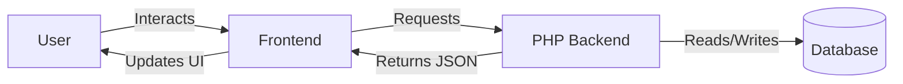
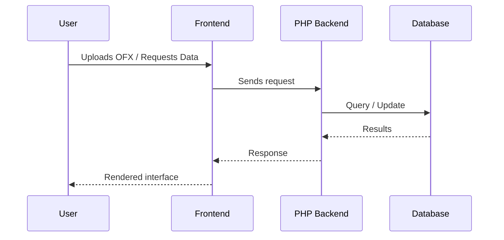

# Architecture

The application uses a static frontend and a PHP backend that communicates with a MySQL database. The frontend interacts with the backend through JSON APIs.

```mermaid
graph LR
    U[User] -->|Interacts| F[Frontend]
    F -->|Requests| P[PHP Backend]
    P -->|Reads/Writes| D[(Database)]
    P -->|Returns JSON| F
    F -->|Updates UI| U
```

## Request Flow

```mermaid
sequenceDiagram
    participant U as User
    participant F as Frontend
    participant P as PHP Backend
    participant D as Database

    U->>F: Uploads OFX / Requests Data
    F->>P: Sends request
    P->>D: Query / Update
    D-->>P: Results
    P-->>F: Response
    F-->>U: Rendered interface
```
