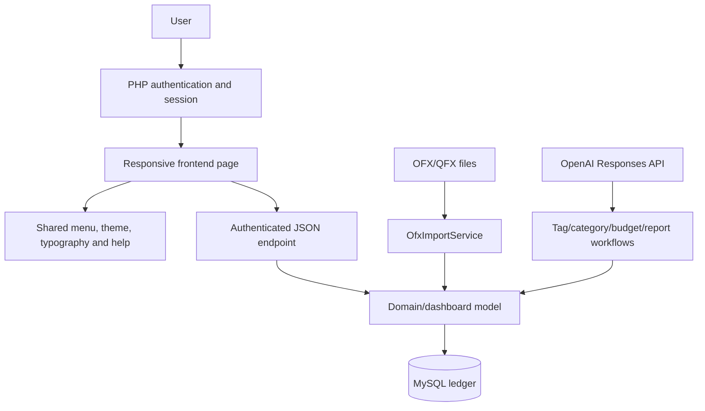
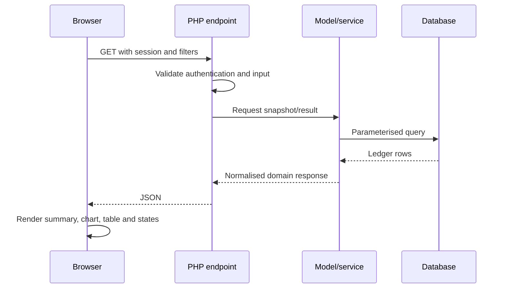
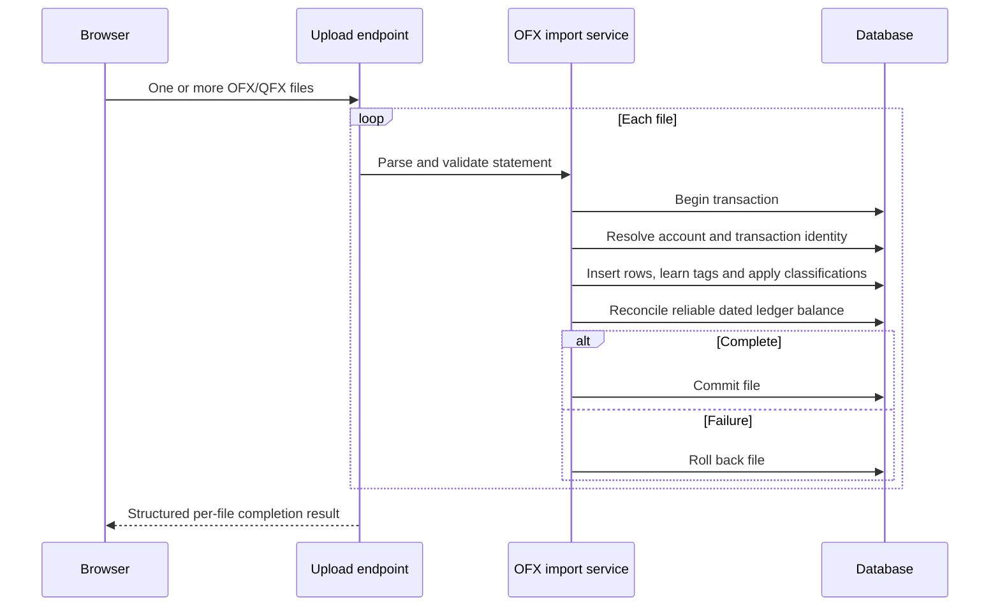

# Architecture

Accounts uses a server-rendered authentication shell, static application pages and authenticated PHP JSON endpoints backed by MySQL. Business and dashboard calculations live in models/services rather than being recomputed independently in the browser.

## Authentication

Password login retains optional TOTP verification. Passkey login is a separate WebAuthn ceremony using a discoverable ES256 credential: the browser selects the account, performs local user verification, and returns a signed assertion. The server consumes a one-time challenge, verifies the exact origin and relying-party hash, checks user-presence/user-verification flags, validates the signature and advances the authenticator counter before creating the normal application session. Only the credential ID, public key and audit metadata are stored; private keys remain with the authenticator or password manager.

Passkey registration requires an existing authenticated session. Users may keep several named credentials and remove their own credentials from User Management. A passkey completes authentication directly and does not trigger TOTP again; password plus TOTP remains the recovery path.

## Repository layout

| Path | Responsibility |
| --- | --- |
| `frontend/*.html` | Application pages and semantic page structure |
| `frontend/*.css` | Shared and specialist presentation layers |
| `frontend/js/` | Page controllers, shared menu, typography, tables and notifications |
| `php_backend/public/` | Authenticated JSON/API entry points |
| `php_backend/models/` | Ledger entities and reusable dashboard calculations |
| `php_backend/services/` | Import and schema-health workflows |
| `php_backend/SchemaCatalog.php` | Canonical managed database schema |
| `php_backend/migrations/` | Explicit one-off data/index migrations |
| `tests/run_tests.php` | SQLite-backed integration/regression suite |

## Read request flow

## Import flow

## Shared financial semantics

Dashboard code must reuse these meanings:

- `amount > 0`: income.
- `amount < 0`: outgoing expenditure, presented as a positive magnitude.
- `transfer_id IS NOT NULL`: internal movement, excluded from analytical totals.
- `IGNORE` tag: deliberately excluded activity.
- Closed account: preserved history, zero current balance.
- Segment: transaction segment when present, otherwise the segment attached to its category.

Daily Burn adds a rate, not another transaction total: each month/segment total is divided by that month’s calendar-day count. Actual daily expenditure remains a separate series.

## Frontend composition

`frontend/js/menu.js` loads the task-led sidebar and shared assets, applies theme/brand/font settings, establishes the single scrolling content panel and loads help, notifications and chart-fullscreen support. `page_header.js` owns title/breadcrumb/subtitle structure. `typography.css` is loaded after page styles to enforce readable operational sizes.

Use native semantic tables for compact read-only content. Use the pinned Tabulator adapter for large, sortable, searchable or virtualised grids. Highcharts receives shared colours and configurable chart typography through `color_map.js`.

## Schema evolution

Update `SchemaCatalog.php` whenever the managed application schema changes. Database Health may apply only catalogue-generated structural repairs. Data transformations remain explicit migrations and must not be hidden inside schema-health actions. The `passkeys` table stores public WebAuthn material and is included in backup format version 6.

### Tag-taxonomy rebuild safety boundary

`TagMigrationSafetyService` separates recovery evidence from future AI classification work. A migration run owns an immutable row for every transaction containing only its tag, category and segment assignments plus its eligibility/protection state. The run stores a SHA-256 hash over those ordered rows. Snapshot creation never updates transactions.

`TagTaxonomyDiscoveryService` owns Phase 2 staging. It deterministically groups eligible snapshot transactions into direction-aware patterns, links every eligible transaction to one staged pattern, and stores AI canonical-tag proposals separately from the live `tags` and `tag_aliases` tables. `TagTaxonomyDiscoveryAi` allowlists pattern/category IDs and refuses protected or rejected names before any proposal is staged. Review and readiness actions update only the staging tables and migration-run status.

Before a restore, the service recomputes the hash, verifies every referenced tag/category/segment still exists, reports missing transactions, and counts transactions imported after the snapshot. A confirmed restore updates only the three classification fields for transactions contained in that run; identity, financial data and later imports remain untouched. Confirmed transfers and `IGNORE`-tagged transactions are protected from later retagging stages.
